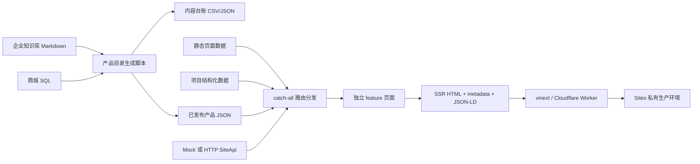

# JUHAO 钜豪照明多页官网详细交接摘要

最后核验：2026-07-13 10:09（Asia/Shanghai）  
项目目录：`/Users/mac/Documents/Codex/2026-07-12/sites-plugin-sites-openai-bundled-3`  
当前分支：`main`  
代码基线提交：`41c2406 Add source evidence galleries to project pages`（交接文档自身提交以 `git log -1` 为准）  
工作树：干净  

> 本文档是当前项目状态的优先入口。`README.md`、`NOTES.md`、`RECON/PRE_RELEASE_ACCEPTANCE.md` 和 `RECON/DOMAIN_CUTOVER_AND_MONITORING.md` 保留了不同阶段的历史结论，其中部分数量、部署和域名状态已经过时；遇到冲突时，以本文档、当前代码、内容台账和 Sites 实时状态为准。

## 1. 一句话结论

项目已经从视觉原型发展为可运行的服务端渲染多页官网：25 个经过门禁的产品详情页已在私有线上第 14 版中可访问，6 个项目已结构化为“项目动态/案例候选”，品牌历程、荣誉、服务和合作内容已补齐；最新第 15 版增加了 6 个项目的 18 张来源标注图，但尚未部署。正式商城分流、企业完工资料、真实 CMS/API、正式咨询提交和正式域名切换仍未完成。

## 2. 当前状态总览

| 范围 | 当前状态 | 证据 |
| --- | --- | --- |
| 产品台账 | 已完成 | 100 款候选、25 款审核发布；台账含审核、在售、参数完整度、图片来源字段 |
| 产品详情页 | 已完成并在私有线上第 14 版可访问 | 25 个唯一 SEO 路由；代表页 `/products/spotlights/12287` 在线返回 200 |
| 项目中心 | 代码已完成，第 15 版未部署 | 6 个页面均有方案范围、产品方向、资料状态；第 15 版新增每页 3 张来源图 |
| 正式完工案例 | 未完成 | 企业知识库没有完工实拍、最终型号、调试/验收记录；不得改写成已完工案例 |
| 品牌历程与荣誉 | 已完成 | 5 条历程、5 条荣誉，均带企业资料编号 |
| 服务网络 | 部分完成 | 已发布总部、商城、工程、经销商四类入口；真实省市服务网点未接入 |
| 经销商合作 | 已完成内容框架 | 经销商、工程、供应商三类合作入口；正式政策和区域权益未发布 |
| 咨询转化 | 前端闭环完成，真实提交未启用 | 家庭、工程、渠道三条路径；仅本地预检，正式 POST 开关关闭 |
| SEO | 多页 SSR 已完成 | metadata、canonical、JSON-LD、robots、sitemap；线上 sitemap 当前 66 条 URL |
| Sites 部署 | 第 14 版已成功，第 15 版仅保存 | 私有线上地址可访问；第 15 版项目图集尚未在线 |
| 正式域名 | 已登记，未验证/未切流 | `juhao.com`、`www.juhao.com` 均为 `pending_validation` |
| 独立商城 | 未完成 | `mall.juhao.com` 当前 TLS 失败，状态 000 |

## 3. 技术架构

这是 Next.js App Router 服务端渲染官网，不是纯客户端 SPA，也不是旧 PHP/CMS 的直接迁移。



### 3.1 运行栈

- Node.js：`>=22.13.0`
- Next.js：16.2.6
- React：19.2.6
- TypeScript：5.9.3
- 构建/运行：Vite 8 + vinext 0.0.50 + Wrangler
- 动效：GSAP 3 + `@gsap/react`
- 样式：CSS Modules + 全局 token
- 数据库：Drizzle/D1 仅保留空骨架，当前业务没有使用数据库
- 托管：OpenAI Sites，Cloudflare Worker 兼容产物

### 3.2 页面解析与渲染链路

1. 首页由 `app/page.tsx` 渲染。
2. 其余路由进入 `app/[...slug]/page.tsx`。
3. `resolveRoute()` 依次解析固定页面、产品详情、产品专题、案例详情和新闻分页。
4. `PageFeature()` 把路由分发给对应 `features/**` 组件。
5. `generateMetadata()` 输出每页独立 title、description、canonical、Open Graph 和 robots。
6. 页面末尾按类型输出 Breadcrumb、WebPage、Article、Service、FAQPage 或 Product JSON-LD。
7. `generateStaticParams()` 注册固定页、10 个产品专题、6 个项目、25 个产品详情和新闻分页。

## 4. 目录与模块设计

### 4.1 路由、SEO 与全局布局

| 文件/目录 | 用途 |
| --- | --- |
| `app/page.tsx` | 首页服务端入口 |
| `app/[...slug]/page.tsx` | 多页 catch-all 路由、metadata、结构化数据、feature 分发 |
| `app/_data/pages.ts` | 页面统一 `PageData` 类型及路由数据汇总 |
| `app/_data/contract-pages.ts` | 固定业务页、文章和 noindex 页面定义 |
| `app/layout.tsx` | 根 metadata、Organization JSON-LD、全局组件 |
| `app/sitemap.ts` | sitemap 生成；包含正式页面、专题、案例、25 个产品和新闻分页 |
| `app/robots.ts` | robots 与 sitemap 地址 |
| `app/not-found.tsx` | 品牌化 404 |
| `app/_components/` | 对 `components/layout` Header/Footer 的应用层重导出 |
| `content/navigation.ts` | 桌面/移动主导航结构 |
| `next.config.ts` | 旧路由 308、商城登录/注册/找回密码跳转 |

### 4.2 全局布局与动效

| 文件/目录 | 用途 |
| --- | --- |
| `components/layout/SiteHeader.tsx` | 桌面导航、移动抽屉、搜索入口、工程 CTA |
| `components/layout/SiteFooter.tsx` | 品牌、方案、服务合作、内容联系和法律分组 |
| `components/layout/FloatingActions.tsx` | 三类悬浮咨询与返回顶部 |
| `components/motion/PageLoader.tsx` | 首屏/路由加载动效 |
| `components/motion/SiteMotion.tsx` | GSAP reveal、路由过场、reduced-motion 降级 |
| `components/motion/HeroDisplacementCanvas.tsx` | 首页 WebGL 位移转场与静态兜底 |
| `components/ui/AccessibleCarousel.tsx` | 键盘、触摸、自动播放和 reduced-motion 兼容轮播 |
| `styles/tokens.css` | 品牌色、字号、间距、动效时长、层级变量 |

### 4.3 页面 feature

| 目录 | 页面职责 |
| --- | --- |
| `features/home/` | 首页 Hero、品牌、方案、智能、资讯和咨询入口 |
| `features/about/` | 品牌介绍、发展历程、荣誉、加入钜豪 |
| `features/catalog/` | 产品中心、专题、产品详情、项目列表、项目详情、资料图集 |
| `features/solutions/` | 方案总览与健康光 |
| `features/business/` | 全屋、酒店、商业、公共、工业场景页 |
| `features/smart-home/` | 智能家居场景与 Tab |
| `features/service/` | 总部/商城/工程/经销商服务入口与 FAQ |
| `features/partners/` | 经销商、工程、供应商合作入口 |
| `features/news/` | 新闻列表、SSR 分页和文章详情 |
| `features/search/` | 站内搜索与状态处理 |
| `features/platform/` | 联系咨询、商城说明页 |
| `features/sustainability/` | 可持续披露框架，当前 noindex |
| `features/utility/` | 下载、法律、隐私等工具页 |

### 4.4 数据与接口

| 文件/目录 | 用途 |
| --- | --- |
| `content/catalog.ts` | 10 个产品专题、6 个项目的结构化数据与证据图 |
| `content/products.ts` | 读取发布产品 JSON，提供按路由/专题查询 |
| `content/governance/` | 产品/案例台账、发布产品、质量报告、URL 与域名迁移台账 |
| `lib/api/types.ts` | `SiteApi`、产品卡、服务网点、搜索、新闻、下载、咨询类型 |
| `lib/api/mock.ts` | 默认数据源；搜索和新闻可用，正式门店/合作数据只是 Mock |
| `lib/api/http.ts` | 未来 CMS/API adapter、HTTPS 限制、10 秒超时和结构校验 |
| `lib/api/index.ts` | 按环境变量选择 Mock 或 HTTP 模式 |
| `lib/consultation.ts` | 家庭、工程、渠道三类咨询的 source/scene/intent 追踪 |
| `db/schema.ts` | 当前为空；不要误认为已有业务数据库 |
| `db/index.ts` | D1 工厂；只有真实绑定后才可调用 |

### 4.5 构建、边缘运行与测试

| 文件/目录 | 用途 |
| --- | --- |
| `worker/index.ts` | vinext Worker 入口、图片处理、6 条垃圾 URL 的 410/noindex |
| `vite.config.ts` | vinext/Vite 构建配置 |
| `.openai/hosting.json` | Sites 项目标识；当前没有 D1/R2 绑定 |
| `scripts/build_product_catalog.py` | 从知识库 + SQL 重建候选台账和 25 个发布产品 |
| `scripts/probe_knowledge_base.py` | 上述生成器的兼容入口 |
| `scripts/check_launch_health.mjs` | 核心路由、410、商城跳转和 sitemap 健康检查 |
| `tests/rendered-html.test.mjs` | SSR、SEO、产品、项目、迁移、404 等 19 项自动化测试 |
| `RECON/` | 取证、路由契约、API 契约、安全与预发布报告 |

## 5. 产品中心

### 5.1 数据源

- 企业知识库：`/Users/mac/Documents/juhao数据库/企业知识库`
- 商品说明：`/Users/mac/Documents/juhao数据库/企业知识库/商城系统/商品说明`
- 商品专题：`/Users/mac/Documents/juhao数据库/企业知识库/商城系统/商品专题分类`
- 商品部门：`/Users/mac/Documents/juhao数据库/企业知识库/商城系统/商品部门索引`
- 商城 SQL：`/Users/mac/Documents/juhao数据库/juhao_mall_2026-07-10_02-41-52_mysql_data.sql`

### 5.2 生成脚本与发布门禁

入口：`scripts/build_product_catalog.py`

门禁条件：

1. SQL 中 `isSale=1`、`goodsStatus=1`、`dataFlag=1`。
2. 至少 4 张图片。
3. 所有图片来自企业商城 OSS 域名。
4. 参数完整度评分不低于 80%。
5. 事业部不能是“未归属部门”。
6. 标题/分类不得命中测试、饮料、食品、纸品等污染关键词。
7. 每专题最多公开 3 款，总量控制在 20—30 款。

注意：

- `parameter_completeness` 是脚本依据参数数量、图片数量、型号和数据质量计算的发布评分，不是第三方检测结论。
- `image_authorization=企业商城渠道素材` 表示素材来自企业商城渠道，不等于已经取得完整法律授权证明；正式公开前仍应由企业确认版权责任。
- 库存、价格和交期只用于后台核验，不在官网承诺实时有效。
- 重新运行脚本会重写台账、发布日期和发布产品 JSON，必须先检查知识库/SQL 是否变化，并审查 Git diff。

### 5.3 当前结果

- 台账总记录：106 条。
- 产品候选：100 款。
- 审核发布产品：25 款。
- 案例台账：6 条。
- 25 款参数完整度：最低 84%，平均 98.2%。
- 产品 ID 唯一，无跨专题重复。

| 专题 | 已发布 |
| --- | ---: |
| 射灯 | 3 |
| 家居顶灯 | 3 |
| 新中式 | 3 |
| 艺术灯 | 3 |
| 水晶吊灯 | 3 |
| 灯带与线性照明 | 3 |
| 开关面板 | 1 |
| 户外照明 | 3 |
| 工程定制 | 3 |
| 家居智能设备 | 0（结构化参数不足） |

### 5.4 输出文件

| 文件 | 内容 |
| --- | --- |
| `content/governance/content-ledger.csv` | 便于人工审核的扁平台账 |
| `content/governance/content-ledger.json` | 完整候选与案例台账 |
| `content/governance/published-products.json` | 25 个公开产品页的唯一数据源 |
| `content/governance/quality-report.md` | 生成日期、数量、分布和门禁摘要 |
| `content/products.ts` | 应用读取层 |
| `features/catalog/ProductDetailPage.tsx` | 产品详情模板 |

### 5.5 产品详情页结构

- 产品名称和型号
- 所属专题、事业部、在售/资料状态
- 结构化参数
- 主图和详情图库
- 安装与选型提示
- 同专题关联产品
- 产品咨询与商城跳转
- Product JSON-LD
- 独立 title、description、canonical 和 sitemap URL

## 6. 项目与案例中心

结构数据：`content/catalog.ts`  
页面：`features/catalog/CatalogPages.tsx`  
样式：`features/catalog/CatalogPages.module.css`

| ID | 页面 | 当前公开阶段 | 已有内容 | 仍缺资料 |
| --- | --- | --- | --- | --- |
| 226 | 深圳华发冰雪世界 JW 万豪酒店 | 签约/中标 | 背景、4 类空间、产品方向、策略、3 张来源图 | 完工实拍、最终型号、调试/验收记录 |
| 231 | 上饶广丰铂尔曼酒店 | 签约/中标 | 大堂、餐饮、宴会、客房方案，3 张来源图 | 完工实拍、最终型号和数量 |
| 228 | 苏州金融街君悦酒店 | 签约/中标 | 公共区、餐饮、宴会、客房方案，3 张来源图 | 交付日期、完工实拍、控制场景和型号 |
| 229 | 南通海门希尔顿逸林酒店 | 签约/中标 | 酒店空间和定制方向，3 张来源图 | 基础照明/控制清单、完工与验收资料 |
| 220 | 扬州经开区“一河两岸” | 签约/中标 | 滨水、建筑、动线、节能方向，3 张来源图 | 夜景完工图、型号数量、控制与能耗验收 |
| 225 | 2026 中国智慧道路照明大会 | 行业活动/荣誉 | 大会、智慧道路方向、荣誉和 3 张现场图 | 展示设备清单、演讲/方案资料；不适用工程完工验收 |

重要边界：

- 企业知识库当前只有原始中标新闻/活动新闻，没有后续完工文章。
- 第 15 版代码中的 18 张图均标注为方案图、概念图或活动现场图，不作为完工证明。
- 不得仅凭新闻中的效果图把 `stage` 改成“已完工案例”。
- 升级为正式案例至少需要：完工实拍、最终产品/系统清单、交付或验收日期、项目方授权；有条件时再补调试记录和成果数据。

## 7. 品牌、服务与合作内容

### 7.1 发展历程

文件：`features/about/AboutPages.tsx`

- 2020：区域渠道战略，企业资料 #149
- 2021：智慧家庭发布，企业资料 #160
- 2024：春季优秀经销商会，企业资料 #192
- 2025：春季新品订货会，企业资料 #205
- 2026：优秀经销商盛典与新品品鉴，企业资料 #224

当前不是完整公司成立史，只是已有可核验企业新闻形成的阶段时间线。成立年份、规模、门店数量等未经审核数据没有加入。

### 7.2 品牌荣誉

- 2019：行业领袖品牌，企业资料 #25
- 2021：智能照明年度影响力品牌创新奖，企业资料 #167
- 2026：工程照明品牌 TOP10，企业资料 #223
- 2026：设计师推荐品牌 TOP10，企业资料 #223
- 2026：中国智慧道路照明大会优秀合作伙伴，企业资料 #225

### 7.3 服务网络

文件：`features/service/ServicePage.tsx`

已发布四类入口：

1. 总部服务窗口
2. 商城与订单服务
3. 工程项目支持
4. 经销商协作

已使用的公开联系方式：

- 服务热线：400-0760-888
- 联系电话：+86 0760 8985 5555
- 邮箱：export@juhaolamp.com
- 地址：广东省中山市横栏镇富庆一路 8 号钜豪工业园

未完成：真实省市服务网点列表、责任主体、营业时间和网点查询接口。`lib/api/mock.ts` 中的广州/上海地址是示例数据，不得公开当作真实网点。

### 7.4 合作内容

文件：`features/partners/PartnersPage.tsx`

已拆分为：

- 经销商合作
- 工程合作
- 供应商合作

页面已说明官网负责内容和意向承接，商城保留采购、订单和经销商系统。未发布区域独家、返点、店数、发货时效等未经企业批准的政策。

## 8. 咨询、API 与后端边界

### 8.1 三类咨询路径

定义：`lib/consultation.ts`

| 方向 | scene | intent | CTA |
| --- | --- | --- | --- |
| 家庭健康光 | `home-health` | `space-advice` | 获取户型/空间建议 |
| 工程项目 | `project` | `project-brief` | 提交项目需求 |
| 渠道合作 | `channel` | `partnership` | 了解合作条件 |

入口会记录 `source`、`scene` 和 `intent`，联系页服务端预选对应方向。

### 8.2 当前咨询状态

- 默认只在浏览器内检查需求摘要。
- 不配置 API 时不会发送或保存联系人资料。
- `NEXT_PUBLIC_JUHAO_CONTACT_ENABLED=false`。
- 正式提交接口、隐私同意、受理责任和数据保留规则尚未完成。

### 8.3 正式 API 预留

契约：`RECON/API_CONTRACT.md`

已定义产品卡、服务地区/网点、合作区域、搜索、新闻、下载和咨询提交接口。当前没有真实 `api.juhao.com` 后端，也没有 D1 表。

不要在以下条件未满足时开启咨询提交：

- HTTPS API 可用并通过结构校验
- CORS/Cookie 策略明确
- CSRF/来源校验、限流和服务端字段校验完成
- 隐私文本、保留期限、删除机制和责任人确认
- 提交成功后有真实受理流程

## 9. SEO、旧URL与安全处理

### 9.1 SEO

- 目标 canonical：`https://juhao.com`
- 在线 sitemap：66 条 URL
- 产品、项目、品牌、方案、新闻均为 SSR HTML
- 产品页有 Product JSON-LD
- 正式页面有 Breadcrumb/WebPage/Service/Article/FAQPage 等结构化数据
- `noindex` 页面不会进入 sitemap，也不会输出页面级结构化数据

当前明确 noindex：

- `/about/join`
- `/sustainability`
- `/downloads`
- `/search`
- `/legal`
- `/privacy`

### 9.2 旧URL迁移

配置：`next.config.ts`  
台账：`content/governance/legacy-url-actions.csv`

已覆盖：

- NVC 参考站旧页面族到 JUHAO canonical 的 308
- `/index.html` 到首页
- `/login.html`、`/register.html`、`/forget.html` 到 `mall.juhao.com`
- 数字新闻详情到新闻中心

### 9.3 垃圾URL

`worker/index.ts` 对 6 条已确认垃圾路径返回：

- HTTP 410
- `X-Robots-Tag: noindex`

这些规则只在新 Worker 接管域名后生效；旧 PHP 服务器仍需清理恶意文件、数据库注入、账号和定时任务。

## 10. 构建、测试与验证

### 10.1 常用命令

```bash
npm install
npm run dev
npm run build
npm run start
npm test
npm run lint
```

### 10.2 产品台账重建

```bash
python3 scripts/build_product_catalog.py
```

执行后必须查看：

```bash
git diff -- content/governance
npm test
npm run lint
```

### 10.3 当前验证结果

- production build：通过
- ESLint：通过
- SSR/SEO/迁移测试：19/19 通过
- 25 个产品均满足审核、在售、参数和图片门禁
- 130 个唯一媒体 URL 验证可访问：106 个产品媒体 + 24 个项目媒体
- 私有线上代表路由返回 200：
  - `/`
  - `/products/spotlights/12287`
  - `/cases/jw-marriott-shenzhen-huafa-snow-world`
  - `/about/history`
  - `/service`
  - `/partners`
- 私有线上 sitemap：66 条 URL

完整健康检查：

```bash
BASE_URL=https://<site-host> \
OAI_SITES_BYPASS_TOKEN=<token> \
node scripts/check_launch_health.mjs
```

不要把旁路令牌写入文件、Git remote、日志或交接文档。

## 11. Sites 托管状态

### 11.1 项目

- Sites project ID：`appgprj_6a533dc64d64819194e7761cf915e12d`
- 项目 slug：`juhao-lighting-2026`
- 访问模式：`custom`，当前为私有访问策略
- 私有线上地址：`https://juhao-lighting-2026.rocky-snail-3254.chatgpt.site`
- `.openai/hosting.json`：仅保存 project ID，D1/R2 均为空

### 11.2 已上线与未上线版本

| 状态 | 版本 | Commit | 说明 |
| --- | ---: | --- | --- |
| 已成功部署 | 14 | `76adf7a` | 25 产品、6 项目结构、品牌/服务/合作、旧 URL 和监控可用 |
| 已保存未部署 | 15 | `41c2406` | 在第 14 版基础上增加 6 个项目的 18 张来源标注图 |

第 15 版 Sites version ID：  
`appgprj_6a533dc64d64819194e7761cf915e12d~appgver_c2b0db4b57d48191aa8b3e36907705c3`

当前线上项目详情页没有“企业资料图集”，这是第 14 版与第 15 版最直观的区别。

### 11.3 接手后的首个托管动作

1. 先读取 Sites hosting 技能和 `.openai/hosting.json`。
2. 不要重新创建 Sites 项目。
3. 直接私有部署已保存的第 15 版。
4. 轮询到 `succeeded` 或 `failed`。
5. 用旁路令牌验证 25 个产品页、6 个项目页和 sitemap。
6. 确认项目详情出现“企业资料图集”。
7. 未经明确批准，不要把访问策略改成公开。

## 12. 正式域名与商城状态

### 12.1 自定义域名

`juhao.com` 与 `www.juhao.com` 已登记到 Sites，但当前均为：

- domain status：`pending`
- SSL status：`pending_validation`
- `last_error`：空

DNS 记录：`content/governance/dns-cutover-records.csv`

当前 4 条验证 TXT 在公开 DNS 中均不存在。可以先添加 TXT 验证记录；不要在商城验收前修改 A/CNAME 切流记录。

### 12.2 当前旧站与商城

2026-07-13 10:09 实测：

- `https://www.juhao.com/`：200，仍是旧 PHP 站
- `https://www.juhao.com/login.html`：200，仍是旧登录页
- `https://mall.juhao.com/`：TLS 失败，HTTP 状态 000
- `https://mall.juhao.com/login.html`：TLS 失败，HTTP 状态 000

因此不能执行正式切流。先完成商城子域名、证书、登录、采购、订单、支付和经销商真实账号验收。

详细门槛：

- `content/governance/domain-cutover-checklist.csv`
- `content/governance/dns-cutover-records.csv`
- `RECON/DOMAIN_CUTOVER_AND_MONITORING.md`
- `RECON/OLD_SITE_SECURITY_SEO_GATE.md`

## 13. 已完成事项

### 产品与内容

- [x] 建立 100 款候选产品台账
- [x] 增加审核状态、在售状态、参数完整度、图片来源字段
- [x] 按门禁发布 25 款产品详情页
- [x] 产品页加入参数、图库、安装提示、关联产品、咨询与商城入口
- [x] 6 个项目增加方案范围、产品方向和资料状态
- [x] 第 15 版为 6 个项目增加 18 张来源标注图
- [x] 补充发展历程和荣誉
- [x] 补充总部、商城、工程、经销商四类服务入口
- [x] 补充经销商、工程、供应商合作内容
- [x] 删除“待确认式演示文案”，拆分家庭/工程/渠道 CTA

### 技术与SEO

- [x] 服务端渲染多页路由
- [x] 独立 metadata、canonical、Open Graph、JSON-LD
- [x] sitemap、robots、404、新闻分页
- [x] 旧路由 308 与垃圾 URL 410
- [x] 移动端 Hero 安全区与深色导航
- [x] reduced-motion 和静态内容降级
- [x] 19 项 SSR/SEO 自动化测试
- [x] Sites 第 14 版私有部署成功

## 14. 未完成事项

按优先级排序：

### P0：部署第 15 版

- [ ] 私有部署已保存的第 15 版
- [ ] 在线验证 6 个项目的“企业资料图集”
- [ ] 在线运行健康检查并记录结果

### P0：补齐正式案例证据

- [ ] 6 个项目的完工实拍
- [ ] 最终产品/系统型号与数量
- [ ] 交付或验收日期
- [ ] 调试/控制场景/验收记录
- [ ] 项目方公开授权
- [ ] 有证据后才把阶段从“中标/活动”升级为“已完工案例”

### P1：真实服务与咨询

- [ ] 真实省市服务网点及责任主体
- [ ] 经销商合作政策和区域状态审核
- [ ] 正式 CMS/API
- [ ] 咨询提交、隐私同意、受理流程、限流和安全控制
- [ ] 下载文件、IES、安装说明和版本管理

### P1：正式内容审核

- [ ] 法律声明与隐私政策
- [ ] 可持续指标、报告和案例
- [ ] 招聘职位与完整企业历史
- [ ] 图片版权/授权证明台账，而不只标注企业渠道来源
- [ ] 真实检测报告与产品级健康光声明

### P2：商城与域名

- [ ] 部署 `mall.juhao.com` 并配置证书
- [ ] 验证登录、注册、找回密码、订单、支付和经销商业务
- [ ] 添加 4 条域名验证 TXT
- [ ] 待商城验收后修改 A/CNAME
- [ ] 合法旧 URL 逐条 301，垃圾 URL 清理和搜索平台移除
- [ ] 提交正式 sitemap 并监控索引量、404、5xx 和搜索词

## 15. 接手执行顺序

### 第一天

1. `git status`，确认仍在 `main` 且工作树干净。
2. `npm install`、`npm test`、`npm run lint`。
3. 私有部署 Sites 第 15 版。
4. 在线验证产品代表页、全部 6 个项目页和 66 条 sitemap。
5. 不修改公开访问策略和正式 DNS。

### 收到项目资料后

1. 将企业提供的文件按项目 ID 建立资料目录或 CMS 记录。
2. 核验图片授权、拍摄时间、项目阶段和型号清单。
3. 更新 `content/catalog.ts` 的 `stage`、`productList`、`completionEvidence` 和图集。
4. 更新内容台账的 `review_status`、`fact_status`、`image_status` 和 `updated_at`。
5. 增加测试，重新构建，保存并私有部署新版本。

### 收到商城/DNS权限后

1. 先部署并验收 `mall.juhao.com`。
2. 只添加 TXT 验证记录，确认 Sites 域名状态变为 active。
3. 降低 TTL，安排维护窗口。
4. 切换 A/CNAME，运行 `CHECK_MALL=1` 健康检查。
5. 提交搜索平台迁移和垃圾 URL 移除。

## 16. 不要做的事情

- 不要把 8,681 条知识库商品直接全部生成页面。
- 不要把食品、饮料、纸品、测试文字等污染类目带入官网。
- 不要把“企业商城渠道素材”误写成法律授权已经完备。
- 不要把方案图、概念图或中标新闻包装成完工案例。
- 不要在没有真实后端和隐私流程时启用咨询提交。
- 不要恢复对 NVC 原站接口、图片、CNZZ 或压缩产物的依赖。
- 不要在 `mall.juhao.com` 未验收时切换 `juhao.com` DNS。
- 不要重新创建 Sites 项目，也不要把短期凭证写入仓库。
- 不要未经用户明确批准把私有 Sites 改为公开访问。

## 17. 文档与事实优先级

接手时按以下顺序判断当前事实：

1. 当前 Git 工作树、提交和实际文件
2. `content/governance/**` 当前台账
3. Sites 实时项目、版本、部署和域名状态
4. 企业知识库与最新商城 SQL
5. 本交接文档
6. `RECON/**` 历史报告
7. `README.md`、`NOTES.md` 中的阶段性数量

已知过时项：

- `RECON/PRE_RELEASE_ACCEPTANCE.md` 仍写 13/13 测试、19 个 sitemap URL、域名未登记；当前分别是 19/19、66 条、域名已登记待验证。
- `RECON/DOMAIN_CUTOVER_AND_MONITORING.md` 仍写部署 pending；第 14 版已在 2026-07-13 成功。
- `README.md`/`NOTES.md` 的“产品与服务仍全部使用 Mock”已不完全准确：25 个产品详情来自知识库 + 商城 SQL；但服务地区、合作区域、下载和正式提交仍是 Mock/未启用。

## 18. 接手人应能从本文档回答的问题

1. 当前线上究竟是哪一版，最新代码为何还没在线？
2. 25 个产品从哪里来，什么条件允许发布？
3. 图片授权字段代表什么、不代表什么？
4. 6 个项目为什么不能称为已完工案例？
5. 产品、案例、品牌、服务、合作分别修改哪些文件？
6. 正式咨询为什么不能开启？
7. `juhao.com` 为什么暂时不能切流？
8. 接手后的第一个安全动作是什么？

如果这些问题无法从最新代码和本文档得到一致答案，应先停下发布动作，重新核对仓库、Sites、知识库和商城状态。
